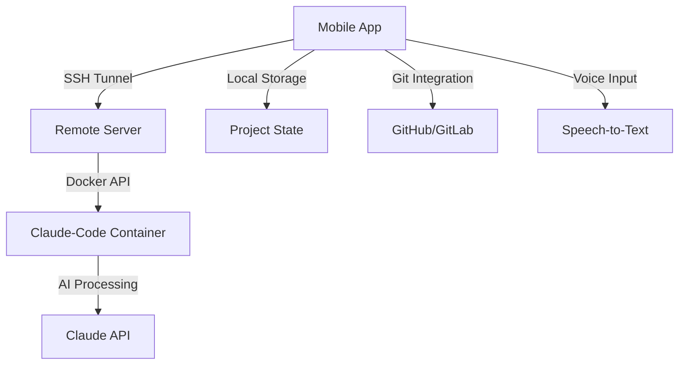

# Claude-Code Mobile App 🚀

> **Transform Ideas into Code, Anywhere, Anytime**

A revolutionary mobile application that brings the power of Claude-Code AI development to your fingertips. Write, test, and deploy code seamlessly while on the go - whether you're commuting, traveling, or simply away from your desk.

[](https://opensource.org/licenses/MIT)
[](https://flutter.dev)
[](https://docker.com)

## 🌟 Vision

Revolutionize mobile development by enabling professional coding capabilities anywhere, transforming dead time into productive development sessions through AI-powered assistance and seamless remote development environments.

## ✨ Key Features

### 🎯 **AI-Powered Development**
- **Claude-Code Integration**: Direct access to Claude's coding capabilities
- **Background Processing**: Continue development while app runs in background
- **Smart Notifications**: Get alerted when human input is required
- **Voice-to-Text**: Code hands-free while driving or traveling

### 🔧 **Remote Development Environment**
- **One-Click Setup**: Automatic Docker container deployment
- **SSH Integration**: Secure connection to remote development servers
- **Session Persistence**: Resume your work exactly where you left off
- **Clean Environments**: Isolated Docker containers for each project

### 📱 **Mobile-First Experience**
- **Cross-Platform**: Flutter-based app for iOS, Android, and Web
- **Intuitive Interface**: Chat-like interaction with Claude-Code CLI
- **Offline Capability**: Local storage for seamless offline work
- **Touch-Optimized**: Mobile-friendly code editing and navigation

### 🚀 **Productivity Boosters**
- **GitHub/GitLab Integration**: Automatic repository management and commits
- **Milestone Tracking**: Auto-commit working features as you progress
- **Real-time Documentation**: Auto-generated technical documentation
- **Testing & Verification**: Automated code testing and validation

## 🏗️ Architecture Overview



## 🚀 Quick Start

### Prerequisites
- Flutter 3.x development environment
- Docker and Docker Compose
- Remote server with SSH access
- Claude API access

### 1. **Clone and Setup**
```bash
git clone https://github.com/9cat/claude-code-app.git
cd claude-code-app
```

### 2. **Deploy Remote Environment**
```bash
# Copy your Anthropic API key
export ANTHROPIC_API_KEY=your_api_key_here

# Deploy Claude-Code container
docker-compose up -d

# Verify deployment
docker exec -it claude-code bash
```

### 3. **Configure Mobile App**
1. Launch the app
2. Enter your SSH connection details (IP, port, username, key/password)
3. App automatically deploys and connects to Claude-Code container
4. Start coding through the chat interface!

## 📱 App Workflow

### **First Launch Setup**
1. **SSH Configuration**: Enter remote server credentials
2. **Auto-Deployment**: App deploys Claude-Code Docker environment
3. **Authentication**: Seamless Claude account login
4. **Ready to Code**: Start your first AI-powered development session

### **Daily Development**
1. **Voice Commands**: "Create a new React component for user authentication"
2. **AI Processing**: Claude-Code processes and implements your request
3. **Review & Iterate**: Chat interface for refinement and questions
4. **Auto-Commit**: Working features automatically saved to Git

## 🛠️ Technology Stack

| Component | Technology | Purpose |
|-----------|------------|---------|
| **Frontend** | Flutter 3.x | Cross-platform mobile development |
| **Backend** | Docker + SSH | Remote development environment |
| **AI Engine** | Claude-Code CLI | AI-powered code generation |
| **Storage** | Hive + SQLite | Local project state persistence |
| **Integration** | GitHub/GitLab API | Version control and collaboration |
| **Communication** | WebSockets | Real-time CLI interaction |

## 🎯 Use Cases

### **🚗 Commute Coding**
- Voice-command new features while driving
- Review and approve AI-generated code
- Background processing continues development

### **✈️ Travel Development**
- Offline project planning and documentation
- Cloud sync when connected
- Full development capability on flights

### **☕ Café Productivity**
- Quick bug fixes and feature additions
- Mobile-optimized code review
- Instant deployment and testing

### **🏠 Remote Work**
- Full development environment anywhere
- Team collaboration through shared containers
- Seamless transition between devices

## 🤝 Contributing

We welcome contributions from the global developer community! This open-source project thrives on collaboration and innovation.

### **How to Contribute**
1. **Fork** the repository
2. **Create** a feature branch (`git checkout -b feature/amazing-feature`)
3. **Commit** your changes (`git commit -m 'Add amazing feature'`)
4. **Push** to the branch (`git push origin feature/amazing-feature`)
5. **Open** a Pull Request

### **Development Guidelines**
- Follow Flutter best practices
- Write comprehensive tests
- Update documentation
- Ensure Docker compatibility

## 📊 Project Status

- [x] **Infrastructure**: Docker environment and SSH integration
- [ ] **Mobile App**: Flutter application development
- [ ] **AI Integration**: Claude-Code CLI connectivity
- [ ] **Voice Features**: Speech-to-text implementation
- [ ] **Git Integration**: GitHub/GitLab automation
- [ ] **Testing & QA**: Comprehensive test suite

See our [Project Plan](PROJECT_PLAN.md) for detailed roadmap and milestones.

## 📄 License

This project is licensed under the MIT License - see the [LICENSE](LICENSE) file for details.

## 🙏 Acknowledgments

- **Anthropic** for the Claude AI platform
- **Flutter Team** for the amazing cross-platform framework
- **Docker Community** for containerization technology
- **Open Source Contributors** for making this project possible

---

**Ready to revolutionize mobile development?** 🚀 [Get Started Now](#quick-start)

*Built with ❤️ by developers, for developers*
